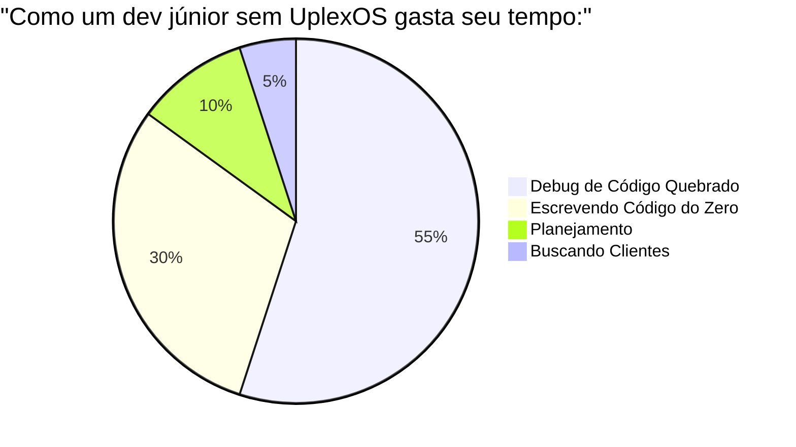
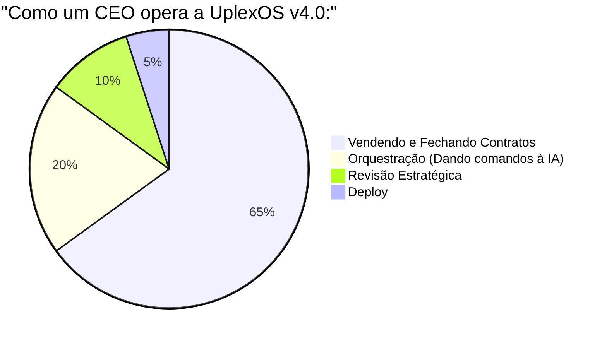
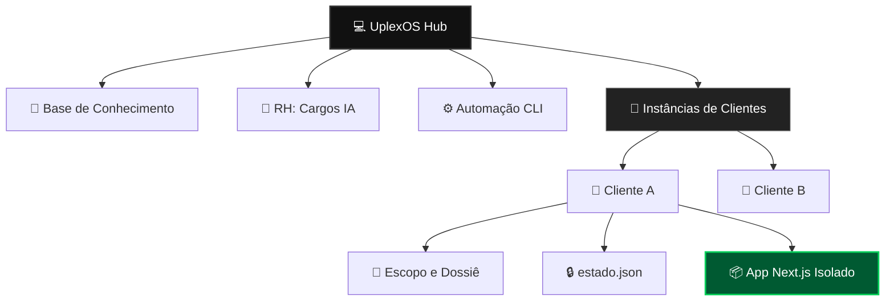

<div align="center">
  <!-- BANNER HERO PREMIUM 100% WIDTH -->
  
  
  <br>

  <h1 align="center">UplexOS <i>v4.0 Enterprise</i></h1>
  <p align="center">
    <b>O Primeiro Sistema Operacional Autônomo para Gestão de Software Houses.</b><br>
    <i>Orquestre departamentos inteiros de Inteligência Artificial direto do seu terminal.</i>
  </p>

  <br>
  
  <!-- BOTÕES DE CTA PRINCIPAIS -->
  <p align="center">
    <a href="https://pay.cakto.com.br/3c9yve2_977106" target="_blank">
      
    </a>
    &nbsp;&nbsp;
    <a href="https://pay.cakto.com.br/38tvvhj_980150" target="_blank">
      
    </a>
  </p>

  <br>

  <!-- BADGES DE STATUS E TECNOLOGIA -->
  <p align="center">
    <a href="https://discord.gg/bvuhYbwfAB"></a>
    
    
  </p>

  <p align="center">
    
    
    
  </p>

</div>

<br><hr><br>

## ⚡ Runtime executável (v4.1)

O UplexOS possui uma CLI multiplataforma em Node.js que aplica a máquina de estados, exige evidências, registra handoffs em uma timeline append-only e bloqueia ações sensíveis sem aprovação.

```bash
# Diagnóstico do ambiente
npm run doctor

# Criar e acompanhar um projeto (Windows, macOS e Linux)
npm run uplex -- init clinica-demo --tier startup --client "Clínica Demo" --goal "Agenda inteligente"
npm run uplex -- status clinica-demo
npm run uplex -- next clinica-demo

# Avançar somente com uma evidência que exista no repositório
npm run uplex -- run clinica-demo --evidence _projetos/clinica-demo/projeto.md

# Ops Console e Quality Gate
npm run uplex -- dashboard
npm run check
```

### Fluxo oficial

`Onboarding → Arquitetura → Design → Engenharia → Qualidade → Segurança → Entrega → Concluído`

- A fonte única das transições é `.uplex/runtime/workflow.json`.
- Estado e tarefas seguem os contratos em `.claude/schemas/`.
- Cada transição gera eventos em `_projetos/<id>/contexto/timeline.jsonl`.
- O gate de entrega exige `--approve`; aprovação genérica nunca autoriza deploy real.
- Os scripts Bash antigos continuam como compatibilidade, mas a CLI Node é o caminho recomendado, inclusive no Windows.

<br><hr><br>

<div align="center">
  <h3>Programar na mão é coisa do passado. A era agora é de quem sabe orquestrar IA.</h3>
  <p>Enquanto desenvolvedores normais gastam 40 horas brigando com erros de tipagem, os usuários do UplexOS assinam contratos de R$ 5.000, delegam a arquitetura para o CTO da IA, o design para o Diretor de Criação da IA, e entregam sistemas SaaS de nível Enterprise antes do fim de semana.</p>
</div>

<br><br>

## 🖥️ A Interface do Sucesso (Como se parece na prática)

Para operar o UplexOS, você não precisa de dashboards complexos. Tudo acontece na beleza e rapidez do seu Terminal.

```bash
# Exemplo real do Handoff Contínuo da UplexOS na sua CLI

➜ /onboarding
[14:00] 📋 Product Manager: Cliente Registrado. Dossiê criado.

➜ /software-architect
[14:05] 📐 Arquiteto: Banco de Dados Prisma mapeado. Passando bastão para o Design.

➜ /marketing-designer
[14:06] ✍️ Copywriter Sênior: Textos de Venda sem Lorem Ipsum gerados.

➜ /frontend-engineer
[14:20] 💻 Frontend Sênior: Telas 100% codadas em Next.js 15. Código enviado para QA.

➜ /data-engineer
[14:21] 📊 Telemetria: PostHog Analytics e Meta Pixel injetados no projeto.

➜ /security-engineer
[14:22] 🛡️ Segurança: Nenhuma chave env vazada. RLS do Supabase ativo. Deploy Aprovado.

➜ /vendedor
[14:25] 📝 Sales Engineer: Proposta Comercial Premium gerada. Prontos para cobrar.
```

<br><hr><br>

## 📉 O Paradigma Antigo vs. 🚀 O Método UplexOS

A grande diferença entre um programador frustrado e o CEO de uma Software House escalável não é a habilidade de codar, é o Processo.





> ⚠️ Atenção: A UplexOS não é um chatbot. É uma arquitetura de Company as Code. Ela transforma a Inteligência Artificial em uma Força de Trabalho Corporativa, onde cada agente atua com um cargo específico, travado por uma Máquina de Estados Finita que impede que código seja gerado sem planejamento.

<br><br>

## 🤖 A Força de Trabalho Autônoma (O Organograma Completo)

A verdadeira revolução do UplexOS está no RH Corporativo. Você não dá prompts genéricos pedindo crie um site; você aciona a linha de montagem com especialistas estritos:

<details>
<summary><b>💼 Product Manager (O Estrategista)</b></summary>
<br>

**Como acionar:** `./.uplex/ops/onboarding.sh`
A porta de entrada. Um script interativo no terminal que entrevista você sobre o cliente e gera um Dossiê. O programador da IA não pode sequer tocar no código até que esse escopo esteja definido e travado.
</details>

<details>
<summary><b>📐 Software Architect (O Mestre de Obras)</b></summary>
<br>

**Como acionar:** `/software-architect` no terminal do Claude Code.
Ele nunca escreve interfaces. Entrega a Modelagem do Banco (Supabase) e a árvore de rotas base (Next.js).
</details>

<details>
<summary><b>✍️ Marketing Designer (O Copywriter Sênior)</b></summary>
<br>

**Como acionar:** `/marketing-designer`
Adeus Lorem Ipsum. Ele gera textos de Landing Pages usando frameworks validados (AIDA/PAS) baseados na Dor do cliente mapeada no Dossiê, além de prompts para imagens no Midjourney.
</details>

<details>
<summary><b>🎨 UI/UX Designer (O Diretor de Criação)</b></summary>
<br>

**Como acionar:** `/ui-designer`
Responsável pelo Front-End Premium. Define as diretrizes estéticas e injeta recomendações de animações sofisticadas com Framer Motion.
</details>

<details>
<summary><b>💻 Frontend Engineer Pro Max (O Executor)</b></summary>
<br>

**Como acionar:** `/frontend-engineer`
O operário de elite. Bloqueado de usar "any" no TypeScript e expor chaves de API. Coda a interface de forma fiel ao Design System, utilizando Server Components e Tailwind v4.
</details>

<details>
<summary><b>💳 Billing & Data Engineer (A Escala de Vendas)</b></summary>
<br>

**Como acionar:** `/billing-engineer` e `/data-engineer`
A Dupla de Growth. O Engenheiro de Dados injeta silenciosamente rastreamento invisível (PostHog / Meta Pixel) para campanhas. O Engenheiro Financeiro automatiza Gateways de Pagamento (Stripe Webhooks), criando o coração do seu SaaS de receita recorrente.
</details>

<details>
<summary><b>📝 Sales Engineer (O Fechador B2B)</b></summary>
<br>

**Como acionar:** `/vendedor`
Transforme código em Dinheiro. Baseado no Escopo atual, ele redige a Proposta Comercial Formal (Pitch Deck) argumentando valor corporativo e um Contrato de Prestação de Serviços juridicamente coerente para proteção contra clientes infinitos.
</details>

<details>
<summary><b>🛡️ Security Engineer (A Muralha)</b></summary>
<br>

**Como acionar:** `/security-engineer`
Se ele encontrar uma vulnerabilidade OWASP na aplicação pronta (ex: chave vazada ou RLS inativo), ele bloqueia a ida pra Vercel. Você é obrigado a assinar um Risk Acceptance para prosseguir.
</details>

<br><hr><br>

## ⚙️ A Arquitetura Militar de Isolamento (Hub & Spoke)

O UplexOS separa o cérebro da sua agência dos sistemas dos seus clientes. Tudo nasce no Hub, mas é executado nas Instâncias Isoladas.



### 💎 A Mágica da Escala: Boilerplate Maker Automatizado
Você transformou o projeto do Cliente A em uma obra de arte tecnológica? Revenda-o amanhã de manhã. Rode o comando:

```bash
./.uplex/ops/create_boilerplate.sh projeto_clinica SaaS-Template
```

A UplexOS suga a pasta do cliente, **destrói todas as chaves de segurança dele**, limpa as pastas de cache pesadas e empacota um sistema SaaS virgem direto na sua Base de Conhecimento. Pronto para o seu próximo faturamento.

<br><hr><br>

<div align="center">
  <h2>A transformação começa na Uplex Academy.</h2>
  <p>A UplexOS é apenas o motor de uma Ferrari. Como pilotar no mercado, atrair clientes High-Ticket e faturar alto, você aprende no nosso curso oficial de formação executiva.</p>
  
  <br>

  <a href="https://pay.cakto.com.br/3c9yve2_977106" target="_blank">
    
  </a>
  
  <br><br>
  
  <a href="https://pay.cakto.com.br/38tvvhj_980150" target="_blank">
    
  </a>
  
  <br><br><br>

  <p><i>Já é aluno ou tem dúvidas?</i></p>
  <a href="https://discord.gg/bvuhYbwfAB" target="_blank">
    
  </a>
  
  <br><br>
  <code>&copy; 2026 UplexOS Enterprise Systems. A nova era do desenvolvimento.</code>
</div>