<div align="center">

  

  <br />

  # UplexOS

  **Plataforma gratuita de orquestração para desenvolvimento de software com assistência de IA.**

  Descreva o que precisa. A UplexOS planeja, distribui, executa, valida e acompanha o trabalho.

  <br />

  [](#estado-atual)
  [](#requisitos)
  [](#qualidade-e-validação)
  [](#princípios)

  [](#runtime-manager)
  [](#como-funciona)
  [](#fluxo-frontend--supabase)
  [](#camada-mcp)

  <br />

  [**Começar agora**](#início-rápido) ·
  [**Ver arquitetura**](#arquitetura) ·
  [**Conhecer recursos**](#o-que-já-funciona) ·
  [**Antes e depois**](#antes-e-depois) ·
  [**Roadmap**](#roadmap) ·
  [**Apresentação completa**](APRESENTACAO-UPLEXOS.md)

</div>

---

## O que é a UplexOS?

A UplexOS é uma camada de orquestração que transforma uma solicitação em linguagem natural em um workflow técnico verificável.

Em vez de exigir que o usuário escolha manualmente comandos, agentes ou departamentos, o sistema identifica as capacidades necessárias, resolve dependências, executa etapas em sequência ou paralelo e registra os resultados.

> **O usuário informa o que precisa. A UplexOS decide como organizar, executar, verificar e comprovar o trabalho.**

### Exemplo

```text
Preciso que você crie uma página frontend com backend no Supabase.
```

A UplexOS interpreta o pedido e monta este fluxo:

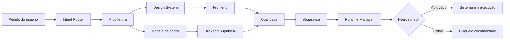
```mermaid
flowchart LR
    U[Pedido do usuário] --> R[Intent Router]
    R --> A[Arquitetura]
    A --> D[Design System]
    A --> DB[Modelo de dados]
    D --> F[Frontend]
    DB --> B[Backend Supabase]
    F --> Q[Qualidade]
    B --> Q
    Q --> S[Segurança]
    S --> RT[Runtime Manager]
    RT --> H{Health check}
    H -->|Aprovado| OK[Sistema em execução]
    H -->|Falhou| BL[Bloqueio documentado]
```

---

## Navegação

<table>
  <tr>
    <td align="center" width="25%"><a href="#início-rápido"><strong>Início rápido</strong></a><br /><sub>Crie e execute um projeto</sub></td>
    <td align="center" width="25%"><a href="#como-funciona"><strong>Como funciona</strong></a><br /><sub>Entenda o workflow</sub></td>
    <td align="center" width="25%"><a href="#segurança-operacional"><strong>Segurança</strong></a><br /><sub>Evidências e aprovações</sub></td>
    <td align="center" width="25%"><a href="#referência-da-cli"><strong>CLI</strong></a><br /><sub>Comandos técnicos</sub></td>
  </tr>
</table>

---

## O que já funciona

<table>
  <tr>
    <td width="50%" valign="top">
      <h3>Orquestração</h3>
      <ul>
        <li>Pedidos em linguagem natural pela CLI</li>
        <li>Registry de capacidades</li>
        <li>Workflows em grafo</li>
        <li>Dependências automáticas</li>
        <li>Execução paralela controlada</li>
        <li>Retomada entre sessões</li>
      </ul>
    </td>
    <td width="50%" valign="top">
      <h3>Governança</h3>
      <ul>
        <li>Evidências com SHA-256</li>
        <li>Timeline append-only</li>
        <li>Aprovações específicas</li>
        <li>Aprovações de uso único</li>
        <li>Sandbox por projeto</li>
        <li>Propagação de falhas e bloqueios</li>
      </ul>
    </td>
  </tr>
  <tr>
    <td width="50%" valign="top">
      <h3>Engines</h3>
      <ul>
        <li>Executor nativo</li>
        <li>Design Engine mínimo</li>
        <li>Quality Engine mínimo</li>
        <li>Security Engine mínimo</li>
        <li>Preparação de Supabase e RLS</li>
        <li>Adaptadores externos em JSON</li>
      </ul>
    </td>
    <td width="50%" valign="top">
      <h3>Operações</h3>
      <ul>
        <li>Runtime Manager persistente</li>
        <li>Porta local dinâmica</li>
        <li>Health check HTTP</li>
        <li>Logs persistentes</li>
        <li>Start, status e stop</li>
        <li>Nove servidores MCP</li>
      </ul>
    </td>
  </tr>
</table>

---

## Funcionalidades e ecossistema

<div align="center">

  **Uma única camada de orquestração para produto, design, engenharia, qualidade, segurança e operações.**

  <br />

  &nbsp;&nbsp;
  &nbsp;&nbsp;
  &nbsp;&nbsp;
  &nbsp;&nbsp;
  &nbsp;&nbsp;
  &nbsp;&nbsp;
  &nbsp;&nbsp;
  

</div>

### Stack operacional atual

As tecnologias abaixo já participam diretamente do runtime, do executor nativo ou das verificações existentes.

<table>
  <tr>
    <td align="center" width="16%"><br /><strong>Node.js</strong><br /><sub>Runtime e CLI</sub></td>
    <td align="center" width="16%"><br /><strong>JavaScript</strong><br /><sub>Core ESM</sub></td>
    <td align="center" width="16%"><br /><strong>HTML5</strong><br /><sub>Frontend nativo</sub></td>
    <td align="center" width="16%"><br /><strong>CSS3</strong><br /><sub>Design responsivo</sub></td>
    <td align="center" width="16%"><br /><strong>Supabase</strong><br /><sub>SQL e RLS</sub></td>
    <td align="center" width="16%"><br /><strong>JSON</strong><br /><sub>Contratos e eventos</sub></td>
  </tr>
</table>

### Linguagens e frameworks

O núcleo atual executa JavaScript, HTML, CSS e SQL. A arquitetura de capacidades e adaptadores foi preparada para ampliar a orquestração para as tecnologias abaixo sem transformar cada stack em um novo comando público.

#### Web e backend

<table>
  <tr>
    <td align="center"><br /><strong>TypeScript</strong></td>
    <td align="center"><br /><strong>React</strong></td>
    <td align="center"><br /><strong>Next.js</strong></td>
    <td align="center"><br /><strong>Vue</strong></td>
    <td align="center"><br /><strong>Nuxt</strong></td>
    <td align="center"><br /><strong>Svelte</strong></td>
    <td align="center"><br /><strong>Angular</strong></td>
  </tr>
  <tr>
    <td align="center"><br /><strong>NestJS</strong></td>
    <td align="center"><br /><strong>Python</strong></td>
    <td align="center"><br /><strong>Django</strong></td>
    <td align="center"><br /><strong>FastAPI</strong></td>
    <td align="center"><br /><strong>PHP</strong></td>
    <td align="center"><br /><strong>Laravel</strong></td>
    <td align="center"><br /><strong>Rails</strong></td>
  </tr>
</table>

#### Sistemas, mobile e aplicações multiplataforma

<table>
  <tr>
    <td align="center"><br /><strong>Go</strong></td>
    <td align="center"><br /><strong>Rust</strong></td>
    <td align="center"><br /><strong>Java</strong></td>
    <td align="center"><br /><strong>Kotlin</strong></td>
    <td align="center"><br /><strong>.NET</strong></td>
    <td align="center"><br /><strong>Swift</strong></td>
    <td align="center"><br /><strong>Dart</strong></td>
  </tr>
  <tr>
    <td align="center"><br /><strong>Flutter</strong></td>
    <td align="center"><br /><strong>React Native</strong></td>
    <td align="center"><br /><strong>Android</strong></td>
    <td align="center"><br /><strong>iOS</strong></td>
    <td align="center"><br /><strong>Electron</strong></td>
    <td align="center"><br /><strong>Tauri</strong></td>
    <td align="center"><br /><strong>Unity</strong></td>
  </tr>
</table>

#### Dados, infraestrutura e entrega

<table>
  <tr>
    <td align="center"><br /><strong>PostgreSQL</strong></td>
    <td align="center"><br /><strong>MySQL</strong></td>
    <td align="center"><br /><strong>MongoDB</strong></td>
    <td align="center"><br /><strong>Redis</strong></td>
    <td align="center"><br /><strong>Prisma</strong></td>
    <td align="center"><br /><strong>Docker</strong></td>
    <td align="center"><br /><strong>Kubernetes</strong></td>
  </tr>
  <tr>
    <td align="center"><br /><strong>Actions</strong></td>
    <td align="center"><br /><strong>Vercel</strong></td>
    <td align="center"><br /><strong>AWS</strong></td>
    <td align="center"><br /><strong>Google Cloud</strong></td>
    <td align="center"><br /><strong>Cloudflare</strong></td>
    <td align="center"><br /><strong>Terraform</strong></td>
    <td align="center"><br /><strong>Linux</strong></td>
  </tr>
</table>

> **Transparência:** os ícones acima representam o ecossistema previsto pelo modelo extensível. A execução nativa atual está concentrada em Node.js, JavaScript, HTML, CSS, JSON, SQL e Supabase. Outras stacks serão ativadas progressivamente por capacidades e adaptadores próprios.

### Setores e tipos de produto

O modelo de roteamento foi projetado para adaptar arquitetura, design, segurança e qualidade ao contexto do setor.

<table>
  <tr>
    <td align="center" width="20%"><br /><strong>Saúde</strong><br /><sub>Clínicas, agenda e dados sensíveis</sub></td>
    <td align="center" width="20%"><br /><strong>Finanças</strong><br /><sub>Fintech, cobrança e risco</sub></td>
    <td align="center" width="20%"><br /><strong>E-commerce</strong><br /><sub>Catálogo, checkout e pedidos</sub></td>
    <td align="center" width="20%"><br /><strong>Educação</strong><br /><sub>Cursos, alunos e conteúdo</sub></td>
    <td align="center" width="20%"><br /><strong>B2B</strong><br /><sub>Portais, SaaS e operações</sub></td>
  </tr>
  <tr>
    <td align="center"><br /><strong>Agendamento</strong><br /><sub>Reservas e disponibilidade</sub></td>
    <td align="center"><br /><strong>Alimentação</strong><br /><sub>Restaurantes e delivery</sub></td>
    <td align="center"><br /><strong>Hotelaria</strong><br /><sub>Hospedagem e reservas</sub></td>
    <td align="center"><br /><strong>Jurídico</strong><br /><sub>Documentos e processos</sub></td>
    <td align="center"><br /><strong>Indústria</strong><br /><sub>Produção e observabilidade</sub></td>
  </tr>
  <tr>
    <td align="center"><br /><strong>Imobiliário</strong><br /><sub>Imóveis, leads e visitas</sub></td>
    <td align="center"><br /><strong>Logística</strong><br /><sub>Entregas e rastreamento</sub></td>
    <td align="center"><br /><strong>Entretenimento</strong><br /><sub>Games, mídia e comunidades</sub></td>
    <td align="center"><br /><strong>Marketing</strong><br /><sub>Campanhas e conversão</sub></td>
    <td align="center"><br /><strong>IA</strong><br /><sub>Copilotos, RAG e automação</sub></td>
  </tr>
</table>

### Setores internos da UplexOS

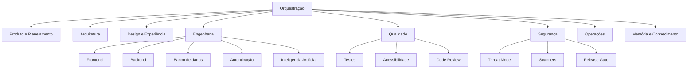
```mermaid
flowchart TB
    O[Orquestração]
    O --> P[Produto e Planejamento]
    O --> A[Arquitetura]
    O --> D[Design e Experiência]
    O --> E[Engenharia]
    O --> Q[Qualidade]
    O --> S[Segurança]
    O --> OP[Operações]
    O --> M[Memória e Conhecimento]

    E --> FE[Frontend]
    E --> BE[Backend]
    E --> DB[Banco de dados]
    E --> AU[Autenticação]
    E --> AI[Inteligência Artificial]

    Q --> T[Testes]
    Q --> AC[Acessibilidade]
    Q --> CR[Code Review]

    S --> TM[Threat Model]
    S --> SC[Scanners]
    S --> RG[Release Gate]
```

<table>
  <tr>
    <td align="center"><br /><strong>Produto</strong><br /><sub>Requisitos e critérios</sub></td>
    <td align="center"><br /><strong>Arquitetura</strong><br /><sub>Decisões e contratos</sub></td>
    <td align="center"><br /><strong>Design</strong><br /><sub>Tokens e componentes</sub></td>
    <td align="center"><br /><strong>Engenharia</strong><br /><sub>Frontend e backend</sub></td>
  </tr>
  <tr>
    <td align="center"><br /><strong>Qualidade</strong><br /><sub>Testes e build</sub></td>
    <td align="center"><br /><strong>Segurança</strong><br /><sub>Risco e autorização</sub></td>
    <td align="center"><br /><strong>Operações</strong><br /><sub>Runtime e health</sub></td>
    <td align="center"><br /><strong>Conhecimento</strong><br /><sub>Contexto e decisões</sub></td>
  </tr>
</table>

### Funcionalidades por área

| Área | Funcionalidades disponíveis ou planejadas |
|---|---|
| Produto | Descoberta, escopo, critérios de aceite, decomposição e priorização |
| Arquitetura | Inspeção, desenho de solução, contratos, decisões e riscos |
| Design | Design system, tokens, tipografia, paletas, responsividade e acessibilidade |
| Frontend | Páginas, componentes, integração de dados, estados e metadata |
| Backend | APIs, regras de negócio, validação, erros e observabilidade |
| Banco de dados | Modelagem, SQL, migrations, RLS e isolamento |
| Autenticação | Login, sessão, autorização e testes negativos |
| Qualidade | Lint, tipos, unitários, integração, E2E, build e code review |
| Segurança | Secrets, SAST, SCA, supply chain, threat model e release gate |
| Operações | Start, stop, logs, portas, health check, deploy e rollback |
| Memória | Timeline, contexto, handoffs, decisões e retomada |
| IA | Integração de modelos, RAG, agentes, avaliações e controle de custo |

---

## Início rápido

### Requisitos

| Requisito | Versão | Obrigatório |
|---|---:|:---:|
| Node.js | 20 ou superior | Sim |
| npm | Compatível com o Node.js | Sim |
| Git | Versão recente | Não |
| CLI externo de IA | Qualquer | Não para o executor nativo |

### 1. Diagnóstico

```bash
npm run doctor
```

### 2. Criar um projeto

<details open>
<summary><strong>Windows PowerShell</strong></summary>

```powershell
npm run uplex -- init clinica-demo --tier startup --client "Clínica Demo" --goal "Página integrada ao Supabase"
```

</details>

<details>
<summary><strong>macOS e Linux</strong></summary>

```bash
npm run uplex -- init clinica-demo \
  --tier startup \
  --client "Clínica Demo" \
  --goal "Página integrada ao Supabase"
```

</details>

### 3. Fazer um pedido

```powershell
npm run uplex -- request clinica-demo --request "Crie uma página frontend com backend no Supabase"
```

Esse único comando:

1. interpreta o pedido;
2. cria o plano;
3. inicia uma execução;
4. resolve dependências;
5. executa capacidades;
6. valida qualidade e segurança;
7. inicia a aplicação;
8. verifica o endpoint local;
9. registra evidências e handoffs.

### 4. Consultar o status

```bash
npm run uplex -- project-status clinica-demo
```

### 5. Ver a aplicação

O Runtime Manager retorna uma URL local:

```text
http://127.0.0.1:<porta-dinâmica>
```

### 6. Parar a aplicação

```bash
npm run uplex -- stop clinica-demo
```

---

## Como funciona

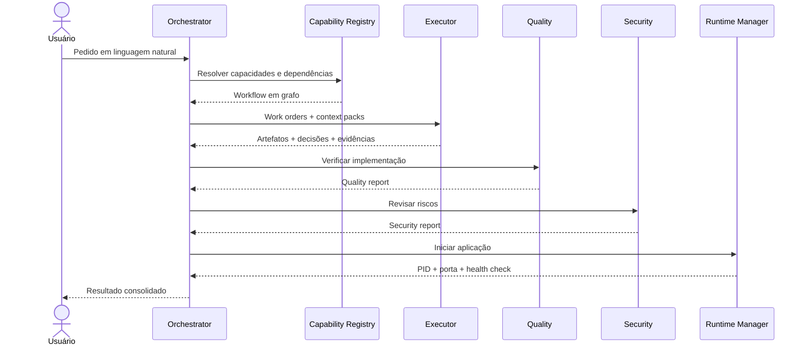
```mermaid
sequenceDiagram
    actor U as Usuário
    participant O as Orchestrator
    participant C as Capability Registry
    participant E as Executor
    participant Q as Quality
    participant S as Security
    participant R as Runtime Manager

    U->>O: Pedido em linguagem natural
    O->>C: Resolver capacidades e dependências
    C-->>O: Workflow em grafo
    O->>E: Work orders + context packs
    E-->>O: Artefatos + decisões + evidências
    O->>Q: Verificar implementação
    Q-->>O: Quality report
    O->>S: Revisar riscos
    S-->>O: Security report
    O->>R: Iniciar aplicação
    R-->>O: PID + porta + health check
    O-->>U: Resultado consolidado
```

### Estados de uma etapa

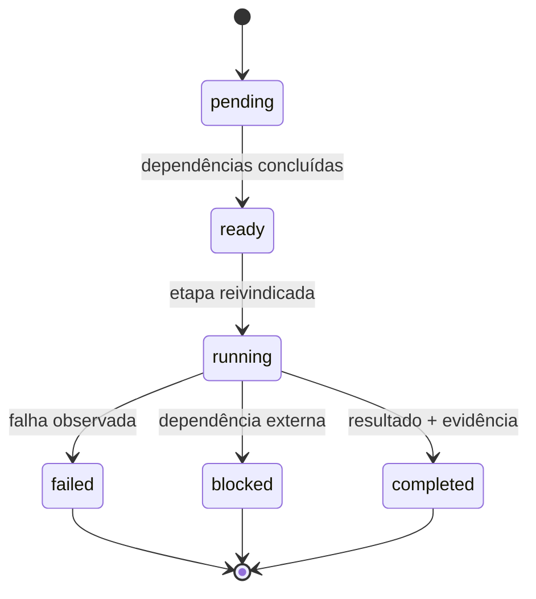
```mermaid
stateDiagram-v2
    [*] --> pending
    pending --> ready: dependências concluídas
    ready --> running: etapa reivindicada
    running --> completed: resultado + evidência
    running --> failed: falha observada
    running --> blocked: dependência externa
    failed --> [*]
    blocked --> [*]
    completed --> [*]
```

### Carga progressiva de contexto

Cada capacidade recebe somente o necessário:

```text
Context Pack
├── pedido original
├── projeto e execução
├── estado atual
├── tarefa ativa
├── documento do projeto
└── handoffs recebidos
```

### Contrato da execução

```text
Work Order
├── objetivo
├── capacidade
├── resultados esperados
├── escopos de leitura
├── escopos de escrita
├── fronteiras de aprovação
└── context pack
```

---

## Arquitetura

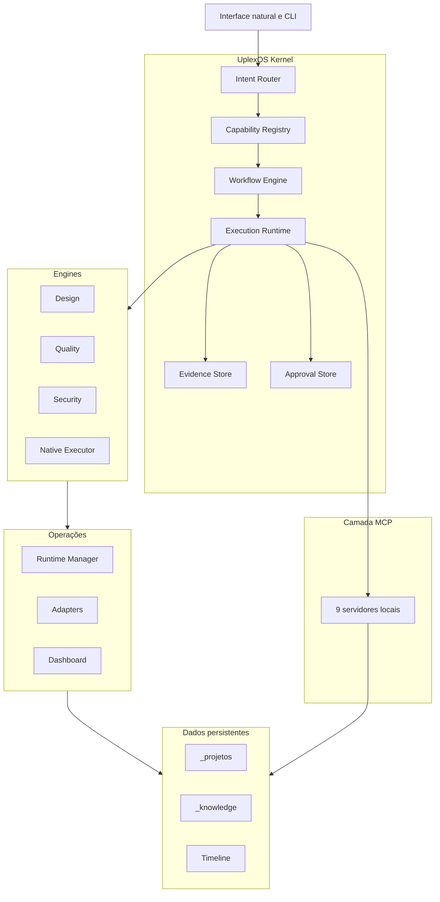
```mermaid
flowchart TB
    UI[Interface natural e CLI]

    subgraph Kernel[UplexOS Kernel]
      IR[Intent Router]
      CR[Capability Registry]
      WE[Workflow Engine]
      ER[Execution Runtime]
      EV[Evidence Store]
      AP[Approval Store]
    end

    subgraph Engines[Engines]
      DE[Design]
      QE[Quality]
      SE[Security]
      NE[Native Executor]
    end

    subgraph Ops[Operações]
      RM[Runtime Manager]
      AD[Adapters]
      DB[Dashboard]
    end

    subgraph Data[Dados persistentes]
      PJ[_projetos]
      KN[_knowledge]
      TL[Timeline]
    end

    subgraph Tools[Camada MCP]
      MCP[9 servidores locais]
    end

    UI --> IR
    IR --> CR
    CR --> WE
    WE --> ER
    ER --> Engines
    ER --> EV
    ER --> AP
    Engines --> Ops
    Ops --> Data
    ER --> MCP
    MCP --> Data
```

### Estrutura do repositório

```text
UplexOS/
├── .uplex/
│   ├── adapters/          # Integrações com executores
│   ├── agents/            # Contratos internos
│   ├── capabilities/      # Registry canônico
│   ├── cli/               # Interface de terminal
│   ├── dashboard/         # Visão operacional
│   ├── engines/           # Design, Quality, Security e executor
│   ├── orchestrator/      # Router, workflows e handoffs
│   ├── runtime/           # Estado, eventos e governança
│   ├── runtime-manager/   # Processos, portas e health checks
│   └── tests/             # Testes automatizados
├── .mcp/
│   ├── lib/               # Primitivas compartilhadas
│   ├── policies/          # Scopes e aprovações
│   ├── servers/           # Servidores MCP locais
│   └── tests/
├── .claude/
│   ├── policies/          # Políticas operacionais
│   ├── schemas/           # Contratos JSON
│   └── skills/            # Superfície legada em migração
├── _knowledge/            # Base de conhecimento
├── _projetos/             # Projetos isolados
├── APRESENTACAO-UPLEXOS.md
├── CLAUDE.md
├── UPLEX.md
└── package.json
```

---

## Fluxo frontend + Supabase

### Capacidades selecionadas

| Ordem | Capacidade | Entrega |
|---:|---|---|
| 1 | Arquitetura | `docs/architecture.md` |
| 2 | Design System | `design-system/system.json` |
| 2 | Modelo de dados | `docs/data-model.md` |
| 3 | Frontend | `code/index.html` e `code/styles.css` |
| 3 | Backend Supabase | migration, helper e `.env.example` |
| 4 | Qualidade | `reports/quality.json` |
| 5 | Segurança | `reports/security.json` |
| 6 | Runtime | `reports/runtime.json` e URL local |

### Estrutura gerada

```text
_projetos/clinica-demo/
├── code/
│   ├── index.html
│   ├── styles.css
│   ├── .env.example
│   └── lib/supabase.ts
├── contexto/
│   ├── estado.json
│   ├── tasks.json
│   ├── timeline.jsonl
│   ├── runtime.json
│   ├── runtime.log
│   └── executions/
├── design-system/
│   ├── system.json
│   └── MASTER.md
├── docs/
│   ├── architecture.md
│   └── data-model.md
├── reports/
│   ├── quality.json
│   ├── security.json
│   └── runtime.json
├── supabase/migrations/
│   └── 0001_initial.sql
└── projeto.md
```

### Limite de segurança

O fluxo prepara a migration e habilita RLS localmente, mas não altera um projeto Supabase remoto.

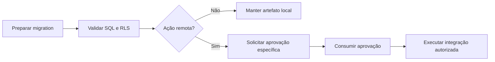
```mermaid
flowchart LR
    P[Preparar migration] --> V[Validar SQL e RLS]
    V --> A{Ação remota?}
    A -->|Não| L[Manter artefato local]
    A -->|Sim| R[Solicitar aprovação específica]
    R --> C[Consumir aprovação]
    C --> X[Executar integração autorizada]
```

---

## Executor nativo

O adaptador padrão `uplex-native` executa as capacidades iniciais sem exigir um CLI externo de IA.

```text
architecture.plan
design.system
database.model
backend.supabase
auth.implement
frontend.implement
quality.verify
security.review
runtime.start
```

### O que ele faz

- produz artefatos reais dentro do projeto;
- registra evidências;
- cria handoffs;
- executa scripts de qualidade existentes;
- executa revisão focal de segurança;
- inicia o frontend local;
- confirma o health check.

### O que ele não faz

- não instala dependências;
- não inventa credenciais;
- não aplica migrations remotas;
- não executa deploy;
- não envia dados a serviços externos;
- não simula scanners ausentes;
- não afirma que um processo está ativo sem verificação.

---

## Runtime Manager

O Runtime Manager mantém processos locais rastreáveis.

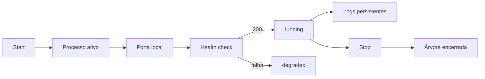
```mermaid
flowchart LR
    S[Start] --> P[Processo ativo]
    P --> O[Porta local]
    O --> H[Health check]
    H -->|200| R[running]
    H -->|falha| D[degraded]
    R --> L[Logs persistentes]
    R --> X[Stop]
    X --> T[Árvore encerrada]
```

### Estados

| Estado | Significado |
|---|---|
| `not_started` | Nenhum processo registrado |
| `starting` | Processo criado, aguardando health check |
| `running` | Processo e health check aprovados |
| `degraded` | Processo ativo sem confirmação completa |
| `stopped` | Processo encerrado |

### Operação

```bash
npm run uplex -- start clinica-demo
npm run uplex -- runtime-status clinica-demo
npm run uplex -- runtime-logs clinica-demo
npm run uplex -- stop clinica-demo
```

---

## Segurança operacional

<table>
  <tr>
    <td width="33%" valign="top"><strong>Arquivos</strong><br /><br />Sandbox por projeto, path traversal bloqueado e escrita atômica.</td>
    <td width="33%" valign="top"><strong>Execução</strong><br /><br />Processos externos sem shell, timeout e limite de saída.</td>
    <td width="33%" valign="top"><strong>Governança</strong><br /><br />Aprovações específicas, temporárias e consumíveis.</td>
  </tr>
  <tr>
    <td width="33%" valign="top"><strong>Evidências</strong><br /><br />SHA-256, tamanho, projeto, execução e etapa.</td>
    <td width="33%" valign="top"><strong>MCPs</strong><br /><br />Scopes obrigatórios e default deny.</td>
    <td width="33%" valign="top"><strong>Runtime</strong><br /><br />Estado running somente após health check real.</td>
  </tr>
</table>

### Evidências

Uma etapa só pode ser concluída com evidência existente dentro do projeto.

```json
{
  "path": "reports/quality.json",
  "sha256": "64-caracteres-hexadecimais",
  "size": 2048
}
```

### Aprovações

```bash
npm run uplex -- approval-request clinica-demo \
  --action database.remote_migration \
  --risk "Aplicar migration no banco remoto"
```

Uma aprovação não pode ser reutilizada em outra ação ou projeto.

---

## Camada MCP

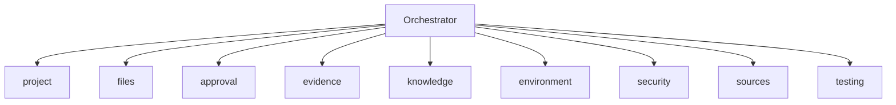
```mermaid
flowchart TB
    O[Orchestrator]
    O --> P[project]
    O --> F[files]
    O --> A[approval]
    O --> E[evidence]
    O --> K[knowledge]
    O --> ENV[environment]
    O --> S[security]
    O --> SRC[sources]
    O --> T[testing]
```

| Servidor | Responsabilidade |
|---|---|
| `project` | Resolver projetos e montar contexto |
| `files` | Operar arquivos dentro do sandbox |
| `approval` | Solicitar, decidir e consumir aprovações |
| `evidence` | Registrar e consultar evidências |
| `knowledge` | Operar a base de conhecimento |
| `environment` | Inspecionar host, ferramentas e stack |
| `security` | Detectar capacidades e executar scans permitidos |
| `sources` | Gerenciar fontes, freshness e proveniência |
| `testing` | Planejar e executar scripts permitidos |

---

## Adaptadores externos

A UplexOS pode encaminhar work orders a processos externos por um protocolo independente de plataforma.

```text
stdin  -> JSON com work order e context pack
stdout <- JSON com resultado e evidências
shell  -> false
```

Resposta esperada:

```json
{
  "status": "completed",
  "summary": "Etapa concluída",
  "evidence": ["docs/resultado.md"],
  "decisions": ["Decisão registrada"],
  "risks": [],
  "limitations": []
}
```

Consulte a disponibilidade:

```bash
npm run uplex -- adapters
```

---

## Referência da CLI

### Comandos principais

| Comando | Função |
|---|---|
| `init` | Criar um projeto |
| `request` | Planejar e executar um pedido |
| `project-status` | Mostrar o estado em linguagem amigável |
| `start` | Iniciar o runtime local |
| `runtime-status` | Verificar processo e health check |
| `runtime-logs` | Consultar logs |
| `stop` | Encerrar o runtime |

### Orquestração técnica

| Comando | Função |
|---|---|
| `plan` | Criar um plano sem executar |
| `execute` | Iniciar uma execução planejada |
| `continue` | Processar etapas prontas |
| `execution-status` | Consultar uma execução |
| `stage-claim` | Reivindicar uma etapa |
| `stage-dispatch` | Enviar uma etapa a um adaptador |
| `stage-complete` | Registrar conclusão manual |
| `stage-fail` | Registrar falha manual |

### Governança e manutenção

| Comando | Função |
|---|---|
| `approval-request` | Solicitar aprovação específica |
| `approval-decide` | Aprovar ou rejeitar uma solicitação |
| `migrate` | Migrar estado legado |
| `adapters` | Ver adaptadores configurados e detectados |
| `validate` | Validar estado e registries |
| `doctor` | Diagnosticar o ambiente |
| `dashboard` | Mostrar visão operacional |

---

## Antes e depois

| Área | Antes | Agora |
|---|---|---|
| Entrada | Vários slash commands | Pedido natural centralizado |
| Organização | Cargos e personas | Capacidades estruturadas |
| Workflow | FSM linear | Grafo dinâmico |
| Delegação | Instruções textuais | Work orders persistentes |
| Contexto | Memória da conversa | Context packs |
| Handoffs | Eventos genéricos | Pacotes com artefatos e decisões |
| Evidências | Existência de arquivo | Sandbox, hash e vínculo à etapa |
| Aprovações | Flag genérica | Projeto, ação, validade e consumo |
| Paralelismo | Manual | Lotes paralelos controlados |
| Retomada | Fase geral | Execução detalhada persistente |
| Runtime | Comando disparado | Processo + porta + health check |
| Testes | 20 aprovados | 42 aprovados |

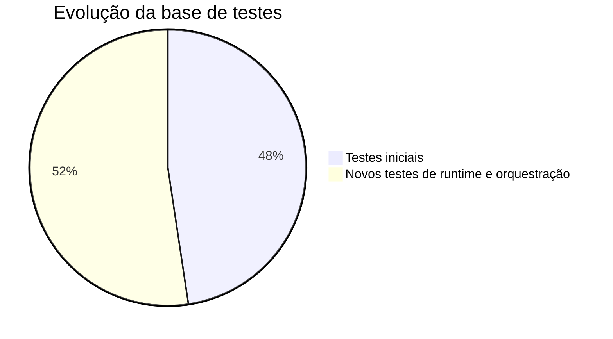
```mermaid
pie title Evolução da base de testes
    "Testes iniciais" : 20
    "Novos testes de runtime e orquestração" : 22
```

Para a comparação completa, consulte [`APRESENTACAO-UPLEXOS.md`](APRESENTACAO-UPLEXOS.md#antes-e-depois).

---

## Qualidade e validação

```bash
npm run check
```

O quality gate executa:

```text
Validação das skills
  -> validação de estado e capacidades
  -> validação do Knowledge Vault
  -> diagnóstico MCP
  -> testes do runtime e MCPs
```

### Estado da última validação

<div align="center">

| Métrica | Resultado |
|---|---:|
| Testes | **42** |
| Aprovados | **42** |
| Falhas | **0** |
| Capacidades canônicas | **9** |
| Servidores MCP ativos | **9** |
| Skills atuais validadas | **48** |

</div>

Existe um aviso legado não bloqueante para `.claude/skills/instalar.md`.

---

## Limites atuais

> A UplexOS distingue capacidade implementada, capacidade não configurada e expansão futura.

- O Intent Router inicial cobre principalmente frontend, backend, Supabase, autenticação e runtime.
- O executor nativo gera uma fundação funcional, não uma aplicação final de produção.
- Migrations Supabase são preparadas localmente, mas não aplicadas remotamente.
- O Quality Engine depende dos scripts realmente configurados no projeto.
- O Security Engine nativo é focal e não substitui scanners profissionais.
- O Runtime Manager nativo atende o frontend estático inicial.
- Frameworks com servidores próprios ainda precisam de integração dedicada.
- Adaptadores nativos para diferentes CLIs de IA serão aprofundados.
- Memória semântica e recuperação avançada ainda serão expandidas.

---

## Roadmap

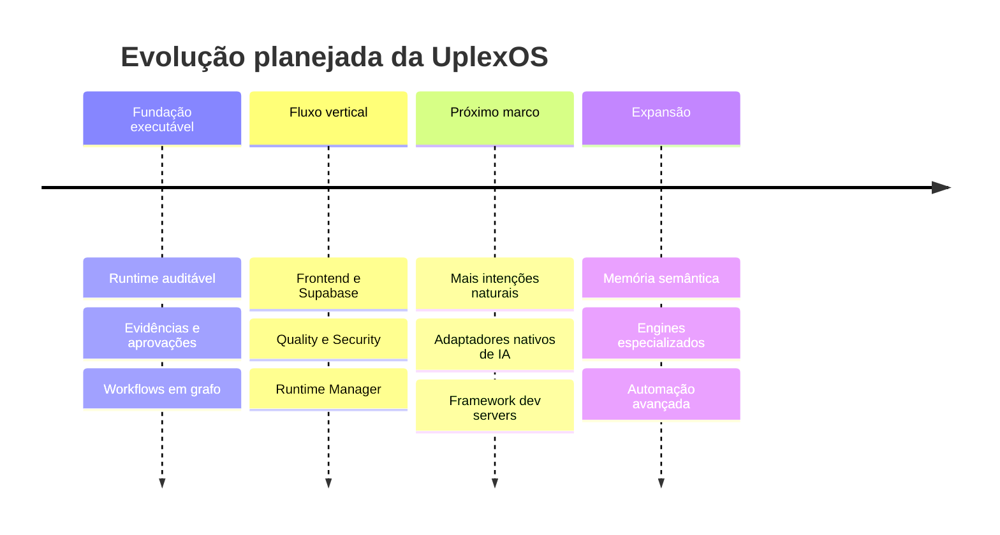
```mermaid
timeline
    title Evolução planejada da UplexOS
    Fundação executável : Runtime auditável
                         : Evidências e aprovações
                         : Workflows em grafo
    Fluxo vertical      : Frontend e Supabase
                         : Quality e Security
                         : Runtime Manager
    Próximo marco       : Mais intenções naturais
                         : Adaptadores nativos de IA
                         : Framework dev servers
    Expansão            : Memória semântica
                         : Engines especializados
                         : Automação avançada
```

### Próximos focos

1. ampliar o roteamento para bugs, refatoração, deploy, mobile, pagamentos, analytics e IA;
2. aprofundar Design, Quality e Security Engines;
3. integrar servidores de desenvolvimento de frameworks;
4. adicionar memória semântica com proveniência;
5. criar adaptadores nativos para diferentes ambientes de IA;
6. reduzir ainda mais a superfície técnica exposta ao usuário;
7. migrar gradualmente a estrutura legada para o registry de capacidades.

---

## Princípios

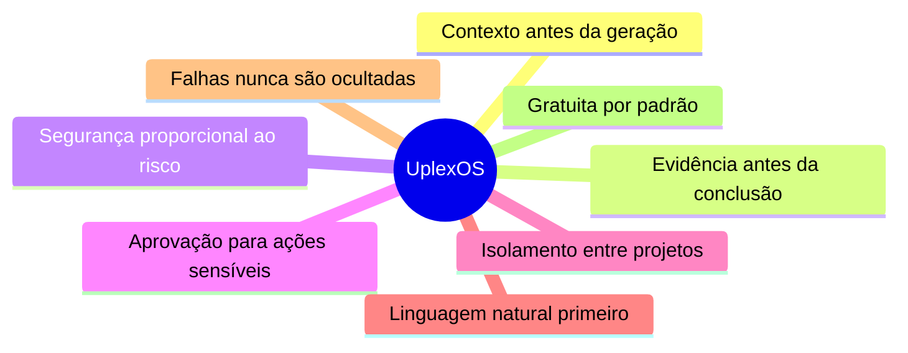
```mermaid
mindmap
  root((UplexOS))
    Contexto antes da geração
    Evidência antes da conclusão
    Segurança proporcional ao risco
    Aprovação para ações sensíveis
    Isolamento entre projetos
    Linguagem natural primeiro
    Falhas nunca são ocultadas
    Gratuita por padrão
```

- **Linguagem natural primeiro:** comandos técnicos são opcionais para a experiência comum.
- **Menor workflow suficiente:** não carregar capacidades desnecessárias.
- **Evidência antes de conclusão:** resultados técnicos precisam ser observáveis.
- **Honestidade operacional:** ferramenta ausente não equivale a verificação aprovada.
- **Segurança proporcional:** controles variam conforme risco e contexto.
- **Autonomia limitada:** ações externas e irreversíveis permanecem governadas.
- **Isolamento:** estado e contexto são separados por projeto.
- **Uso gratuito:** a plataforma não possui bloqueios comerciais internos.

---

## Documentação

<table>
  <tr>
    <td width="50%" valign="top"><a href="APRESENTACAO-UPLEXOS.md"><strong>Apresentação completa</strong></a><br /><sub>Visão, arquitetura e antes/depois.</sub></td>
    <td width="50%" valign="top"><a href="UPLEX.md"><strong>Visão do sistema</strong></a><br /><sub>Manifesto e princípios operacionais.</sub></td>
  </tr>
  <tr>
    <td width="50%" valign="top"><a href="CLAUDE.md"><strong>Operação e compatibilidade</strong></a><br /><sub>Regras atuais e superfície legada.</sub></td>
    <td width="50%" valign="top"><a href=".mcp/README.md"><strong>Camada MCP</strong></a><br /><sub>Ferramentas locais governadas.</sub></td>
  </tr>
</table>

Referências técnicas:

- [Registry de capacidades](.uplex/capabilities/registry.json)
- [Registry de adaptadores](.uplex/adapters/registry.json)
- [Schemas](.claude/schemas/)
- [Testes do runtime](.uplex/tests/)
- [Testes MCP](.mcp/tests/)

---

<div align="center">

## Construa pelo objetivo, não pela complexidade

**A UplexOS transforma uma necessidade em um processo coordenado, verificável e retomável.**

[](#início-rápido)
[](APRESENTACAO-UPLEXOS.md)
[](#arquitetura)

<br />

`UplexOS v4.1.0` · Gratuita · Node.js 20+

</div>
